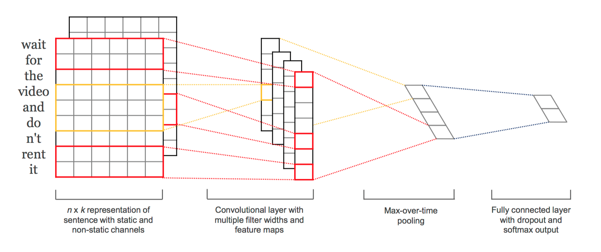

## 딥러닝(CNN&RNN)을 이용한 영화 리뷰 평점 예측

=====
이번 2018 NSML 해커톤 과제였던 영화 댓글을 이용한 평점 에측은 비교적 쉽게 데이터를 구할 수 있으면서, 여러 방면으로 응용될 수 있기 때문에 굉장히 흥미로운 주제입니다. 네이버 영화 댓글을 이용한 평점 예측을 CNN & RNN을 이용해 구현하고, 위의 문제 해결에 어떤 모델이 가장 좋은 성과를 보이는 결과를 비교합니다. 

(이 코드에서 이용한 CNN 모델은 [Yoon Kim님의 논문] (https://arxiv.org/abs/1408.5882)을 참고하여 구현했습니다.)

  

## 1. 모델 설계 및 특징

=====
### A. CNN
텍스트 데이터 처리엔 일반적으로 RNN을 사용하는데, 참고 논문의 CNN 모델은 다음과 같은 장점을 가지고 있으므로 다양한 버전으로 구현해 결과를 비교합니다. 

- 데이터 전처리 단계에서 따로 처리하지 않아도 필터 크기에 따라 다양한 token의 정보를 모두 반영할 수 있다. (filter 크기에 따라 n-gram 반영, 여러 크기의 필터를 사용해도 max-pooling을 이용해 처리 가능)
- multi-layer 구조를 응용하여 여러 형태소 분석기의 결과를 모두 input data로 전달할 수 있다. (본래 RGB 이미지를 처리할 때 3개의 레이어를 만들어 정보를 반영하듯이)

\<Yoon Kim님 논문의 CNN 모델 구조>

### B. RNN
문장은 단어의 연속으로 이루어진 sequential data라는 점에서 이전 데이터의 상태를 반영함으로써 연속적인 데이터를 처리하는 RNN은 가장 일반적인 접근입니다. 이번 실험에선 4가지의 RNN 모델을 비교합니다.

추가적으로 convolutional 레이어와 recurrent 레이어를 혼합해 설계한 모델과 감성 사전을 통한 영화 평점 예측 모델(기존 한국어 영화 평점 예측에 사용했던 딥러닝이 아닌 모델)의 결과도 함께 비교합니다.

  

## 2. 분석 프로세스

=====

### 1) 데이터 시각화 및 전처리 : 
데이터 형태를 확인하고, tokenizer별 특징을 체크합니다. 텍스트 임베딩은 은전한닢 프로젝트의 mecab tokenizer, cohesion tokenizer를 이용한 뒤 word2vec으로 임베딩한 데이터와 fastText를 이용해 tokenizing & 임베딩한 데이터를 이용합니다. 여기서 문장의 품사에 따라 예측하여 토큰화하는 mecab과 음절이 나올 확률에 따라 토큰화하는 cohesion tokenizer의 특성도 같이 비교했습니다. (cohesion tokenizer는 [ratsgo님의 블로그](https://ratsgo.github.io/from%20frequency%20to%20semantics/2017/05/05/cohesion/)를 참고하였습니다.)

결과적으로 cohesion은 주어진 텍스트에서 특정 음절이 다음 음절에 뒤이어 나올 확률에 따라 단어를 예측해 토큰화하므로, Out of Vocabulary에 더 강점을 보이며 사전에 없는 단어라도 자주 관측된다면 포함시켜 비속어/은어 등의 단어를 잘 나눈다. 반면, mecab은 사전에 없는 단어는 처리하지 못하지만 사전에 등록되어있다면 다른 어미가 결합해있어도 같은 어근으로 분류할 수 있다는 장점이 있다.  
[데이터 시각화와 자세한 분석 결과 노트북](./ipynb/movie_review_visualization.html)

### 2) 모델 구현 : 
모델은 CNN과 RNN을 이용한 모델 각각 5가지, 4가지와 혼합 모델, 총 10개의 모델의 결과를 비교합니다. (각 모델별 자세한 설계와 구현은 ipynb를 참고해주세요.)

#### 각 모델 별 MSE :  
A-1) single layer CNN /w mecab  
A-2) single layer CNN /w cohesion  
A-3) single layer CNN /w fastText  
A-4) multi layer CNN /w mecab & cohesion & fastText  
A-5) FC layer를 계층 구조로 설계한 CNN  
B-1) RNN /w LSTM cell  
B-2) bidirectional RNN /w LSTM cell  
B-3) RNN /w GRU cell  
B-4) FC layer를 계층 구조로 설계한 LSTM  
C-1) 혼합 모델

  

## 3. 결과 비교

=====
<결과 비교>

  

## 추가) 감성 사전을 이용한 영화 예측

=====
ㅁㄴㅇㄹㅁㄴㅇㄹ

  

## 참고 
1) [Yoon Kim. 2014. Convolutional Neural Networks for Sentence Classification] (https://arxiv.org/abs/1408.5882) 
2) [ratsgo님의 블로그](https://ratsgo.github.io/from%20frequency%20to%20semantics/2017/05/05/cohesion/) 
3) [오연주, 채수환. 2015. 영화평과 평점을 이용한 감성 문장 구축을 통한 영화 평점 추론] (http://www.dbpia.co.kr/Journal/ArticleDetail/NODE06291845)
